# MirrorTouch (미러터치) 📱🖥️

MirrorTouch is a high-performance, real-time wireless screen-sharing and remote-touch control system that extends your macOS desktop to an iOS device (iPhone/iPad) over Wi-Fi.

맥북 화면을 와이파이를 통해 아이폰 보조 모니터로 확장하고, 아이폰의 터치 제스처로 맥북을 원격 제어할 수 있는 고성능 무선 디스플레이 공유 솔루션입니다.

---

## 🌟 Key Features (주요 기능)

- **Wi-Fi Extended Display**: Create a virtual secondary display on macOS and stream it to iOS with ultra-low latency. (와이파이를 통해 가상 보조 디스플레이를 생성하고 저지연 실시간 비디오 스트리밍을 제공합니다.)
- **Aspect-Ratio Fitting (Game Mode)**: Automatically scales the display to fit standard resolutions (including 4:3 Game Mode `1024x768` and 19.5:9 optimized mobile resolutions) with clean, automatic letterboxing/pillarboxes. (4:3 게임 모드 `1024x768` 및 19.5:9 모바일 비율 등 다양한 가상 화면비를 왜곡 없이 중앙 정렬 및 핏합니다.)
- **Edge Cutoff Prevention**: Added safety margins (16pt left/right, 8pt top/bottom) to prevent UI elements from being cut off by the iPhone notch, dynamic island, or rounded corners. (아이폰 노치나 라운드 모서리에 화면이 잘리는 현상을 막기 위해 자동 안전 레터박스를 배치했습니다.)
- **Monotonic Display Timing**: Automatically aligns frame presentation timestamps (PTS) and flags `displayImmediately` to ensure stutter-free real-time rendering. (디코드 프레임의 실시간 출력을 위해 타임스탬프 동기화 및 즉각 출력 구조를 설계하여 렉 없는 렌더링을 제공합니다.)
- **Zero-Latency Touch Input**: Map touch gestures on the iOS device back to the macOS host to control the system. (아이폰의 터치 드래그/클릭 좌표를 1:1 보정 계산하여 맥북 마우스 이벤트로 원격 전달합니다.)
- **Auto-Discovery (Bonjour)**: Instant host discovery over local network without manual IP entry. (애플 Bonjour 서비스 탐색 기술을 적용해 복잡한 IP 입력 없이 자동으로 컴퓨터를 찾아 연결합니다.)

---

## 🏗️ System Architecture (시스템 구조)

```mermaid
graph LR
    Mac[macOS Host] -- "1. Virtual Screen" --> VD[Virtual Display]
    VD -- "2. ScreenCaptureKit" --> Capturer[ScreenCapturer]
    Capturer -- "3. VideoToolbox (H.264)" --> Encoder[VideoEncoder]
    Encoder -- "4. TCP Network Socket" --> Client[iOS DisplayClient]
    Client -- "5. VideoToolbox (H.264)" --> Decoder[VideoDecoder]
    Decoder -- "6. DisplayLayer (PTS)" --> Render[AVSampleBufferDisplayLayer]
    Render -- "7. Touch Input" --> Gesture[DragGesture]
    Gesture -- "8. Touch Coordinates (TCP)" --> Mac
```

---

## 🚀 How to Run (실행 및 연동 방법)

### 💻 macOS Host (`macOS-Host`)
1. Download or compile `macOS-Host.app`. (배포용 앱 `macOS-Host.app`을 실행합니다.)
2. Select your target resolution (e.g. `Game Mode 1024x768 - 4:3` or `iPhone 13/14 Pro - Optimized`). (원하는 보조 모니터 해상도 및 화면비를 선택합니다.)
3. Click **Start Server** and **Create Display**. (서버 구동 및 디스플레이 생성을 활성화합니다.)

### 📱 iOS Client (`iOS-Client`)
1. Open the project in Xcode. (Xcode에서 `iOS-Client.xcodeproj`를 엽니다.)
2. Connect your physical iPhone. (본인의 실기기 아이폰을 맥북에 연결합니다.)
3. Change the Build Configuration to **Release** (Product > Scheme > Edit Scheme... > Run > Release) for maximum performance. (최상의 와이파이 프레임 속도를 위해 빌드 구성을 **Release**로 변경합니다.)
4. Press **Cmd + R** to install the app. (Cmd + R을 눌러 아이폰에 앱을 영구 배포합니다.)
5. Launch the app and select your Mac from the host list. (아이폰에서 앱을 켜고 자동으로 탐색된 맥북 호스트를 터치해 연결합니다!)
