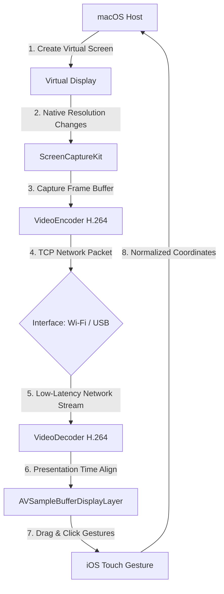

# MirrorTouch 📱🖥️

MirrorTouch is a high-performance, real-time screen-sharing and remote-touch control system that extends your macOS desktop to an iOS device (iPhone/iPad). It allows you to use your iPhone as a secondary touch-sensitive monitor for your Mac over both wireless Wi-Fi and high-speed USB cable connections.

---

## 🌟 Key Features

- **Dynamic Resolution Tracking**: The virtual display supports a wide variety of standard aspect ratios (4:3, 16:9, 16:10, and iPhone-native 19.5:9). When a game or app changes the screen resolution mid-stream (e.g., entering fullscreen via `Alt+Enter`), the host dynamically adapts, restarts the stream session at the new size, and maintains 1:1 pixel alignment.
- **Wired (USB) & Wireless (Wi-Fi) Modes**: Connect wirelessly via auto-discovered Bonjour services, or connect over a high-speed USB cable for maximum bandwidth and zero latency.
- **Interface Type Detection**: Shows visual indicators (📶 Wi-Fi vs. 🔌 USB/Cable) in the host list, making it clear which interface is being utilized.
- **Direct IP Connection (Wired Mode)**: Easily connect directly using the host's IP address (typically `172.20.10.2` when using iOS Personal Hotspot over USB) if automatic discovery is blocked.
- **Host IP Display Panel**: The macOS Host application displays all active IPv4 network interface addresses, allowing quick and easy reference when configuring manual connections.
- **Aspect-Ratio Fitting & Notch Prevention**: Automatically adds letterboxing/pillarboxing with proper safety margins (16pt left/right, 8pt top/bottom) to fit mobile screens perfectly without UI cutoffs from the iPhone notch, rounded corners, or Dynamic Island.
- **Zero-Latency Touch Mapping**: Maps drag and click gestures on the iOS device back to macOS coordinates in real-time.
- **Monotonic Presentation Timestamps**: Synchronizes video decode presentation timestamps (PTS) with `displayImmediately` flags to ensure stutter-free 60fps real-time rendering.
- **One-Click Deploy Script**: Includes a local terminal script to build in Release mode and deploy the host application directly to `/Applications`.

---

## 🏗️ System Architecture



---

## 🚀 How to Run

### 💻 macOS Host (`macOS-Host`)

#### Automatic Deployment (Recommended)
You can easily build the Release version of the host and deploy it directly to your `/Applications` folder using the included deployment script:
1. Open Terminal and navigate to the project directory.
2. Run:
   ```bash
   ./deploy_mac.sh
   ```
3. Open `macOS-Host.app` from your Applications folder or Launchpad.
4. Click **Start Server** and **Create Display**.
5. *Optional*: Adjust the resolution, scale, or layout of the virtual display `WiFi-Extension` at any time under **macOS System Settings > Displays**.

### 📱 iOS Client (`iOS-Client`)

1. Open `iOS-Client/iOS-Client/iOS-Client.xcodeproj` in Xcode.
2. Connect your physical iPhone/iPad to your Mac.
3. Select your device as the run destination.
4. Set the Build Configuration to **Release** (*Product > Scheme > Edit Scheme... > Run > Build Configuration: Release*) to enable compiler optimizations and hardware acceleration.
5. Press **Cmd + R** to compile and run the app.
6. Choose your connection method:
   - **Auto Discover**: Connect with a single tap to any automatically detected host (look for the 🔌 badge for USB wired connections).
   - **Direct IP (USB / Wired)**: Turn on *Personal Hotspot* on your iPhone, connect the USB cable, find the Mac's IP listed in the host window, enter it (typically `172.20.10.2`), and click connect.
